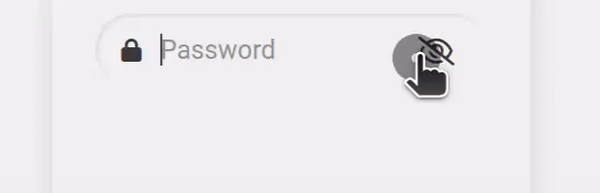
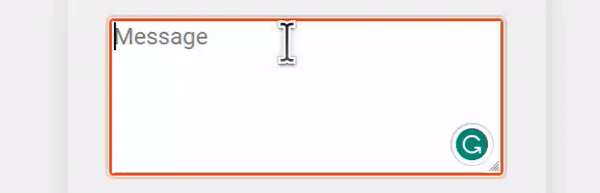
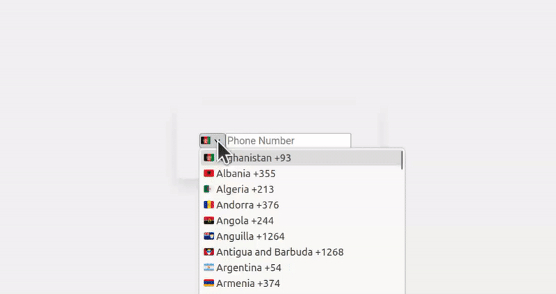

# 💡 Input Yew

[](https://crates.io/crates/input_yew)
[](https://crates.io/crates/input_yew)


## 🎬 Demo

| Input Type | Demo |
| --- | --- |
| Text Input |  |
| Textarea Input |  |
| Text Input |  |
| Telephone Input |  |

## 📜 Prologue

This custom reusable input functional component is a solution built exclusively for the Rust Yew framework. Seamlessly integrating into your Yew applications, it combines powerful functionality with comprehensive accessibility features. With a focus on reusability and customizability, this component empowers you to effortlessly create dynamic input fields that adapt to various forms of user input.

## 🤔 Why is this Component Useful?

The Yew Custom Reusable Input Component is a powerful tool designed to make your life as a Yew developer easier and more enjoyable. Let's explore some of the reasons why this component is an essential addition to your web development arsenal:

1. 🔄 Reusability: No repetitive code! This component is built to be highly reusable, allowing you to sprinkle it across your application without any fuss.

1. 🎨 Customizability: You can now fine-tune the appearance and behavior of the input component to fit your specific needs and aesthetics.

1. ✔️ Validations: You can easily add your custom validation functions.

1. 🎫 Event Handling: The component exposes the `oninput` event handler, making it super easy to implement dynamic behavior based on your interactions.

1. ♿ Accessibility: This component was designed with accessibility in mind, ensuring that it's user-friendly and perceivable by all, regardless of ability.

1. ❌ Error Handling: When users provide invalid input, the component gracefully displays clear error messages, guiding them towards valid data entry and enhancing the overall user experience.

## ⚙️ Installation

You can quickly integrate the Yew Custom Reusable Input Component into your Yew project by following these simple steps:

1. First, make sure you have Yew set up in your project. If not, check out the [Yew documentation](https://yew.rs/docs/getting-started/introduction) for installation instructions.

2. Then, install the input component package using your preferred package manager:

   ```bash
   $ cargo add input_yew
   ```

3. Finally, import the component into your Yew application and start using it to power up your forms and user interactions.

## 🛠️ Usage

Using this custom reusable input component is a breeze! Simply follow these steps:

1. Import the component into your Yew application:

   ```rust
   // Add these lines at the beginning of your file, make sure you have `regex` installed for input validation. 
   use yew::prelude::*;
   use regex::Regex;
   use input_yew::CustomInput;
   ```

1. Use the `CustomInput` component wherever you need an input field:

   ```rust
   fn validate_email(email: String) -> bool {
       let pattern = Regex::new(r"^[^ ]+@[^ ]+\.[a-z]{2,3}$").unwrap();
       pattern.is_match(&email)
   }


   #[function_component(LoginForm)]
   pub fn login_form() -> Html {
       let input_email_ref = use_node_ref();
       let input_email_handle = use_state(String::default);
       let email_valid_handle = use_state(|| true);
       let onsubmit = Callback::from(move |event: SubmitEvent| {};
       html! {
             <form action="#" aria-label="Sign In Form" onsubmit={onsubmit}>
                 <CustomInput
                   input_type={"text".to_string()}
                   input_handle={input_email_handle}
                   name={"email".to_string()}
                   input_ref={input_email_ref}
                   input_placeholder={"Email".to_string()}
                   icon_class={"fas fa-user".to_string()}
                   icon={"fas fa-user".to_string()}
                   error_message={"Enter a valid email address".to_string()}
                   form_input_field_class={"form-one-field".to_string()}
                   form_input_error_class={"error-txt".to_string()}
                   required={true}
                   input_valid_handle={email_valid_handle}
                   validate_function={validate_email}
                 />
             </form>
       }
   }
   ```

1. Customize the input component's appearance and behavior according to your project requirements.

## 🔧 Props

| Name | Type | Description | Example |
| --- | --- | --- | --- |
| input_type | Option<String> | The type of the input. | "text", "password", "tel, "textarea", "date". |
| label | Option<String> | The label to be displayed for the input field. | "Username", "Email". |
| name | Option<String> | The name of the input field, used for form submission and accessibility. | "username", "email". |
| required | Option<bool> | Indicates whether the input is required or not. | true, false. |
| input_ref | NodeRef | A reference to the DOM node of the input element. | `use_node_ref()`, |
| error_message | Option<String> | The error message to display when there is a validation error. | "Invalid input", "Field is required". |
| form_input_class | Option<String> | The CSS class to be applied to all inner elements. | "form-input-container", "input-group". |
| form_input_field_class | Option<String> | The CSS class to be applied to the inner input element and icon. | "form-input-field", "input-icon". |
| form_input_label_class | Option<String> | The CSS class to be applied to the label for the input element. | "form-input-label". |
| form_input_input_class | Option<String> | The CSS class to be applied to the input element. | "custom-input". |
| form_input_error_class | Option<String> | The CSS class to be applied to the error div element. | "input-error-message". |
| icon_class | Option<String> | The CSS class to be applied to the start icon element. | "input-icon". |
| input_handle | UseStateHandle<String> | The state handle for managing the value of the input. | use_state("initial value".into()).handle(), |
| input_valid_handle | UseStateHandle<bool> | The state handle for managing the validity state of the input. | use_state(true).handle(), |
| validate_function | Callback<String, bool> | A callback function to validate the input value. It takes a `String` as input and returns a `bool`. | Callback::from(|value: String| value.len() >= 8), |
| eye_active | Option<String> | The icon when the password is visible. | "fa fa-eye" in case of using **FontAwesome**. |
| eye_disabled | Option<String> | The icon when the password is not visible. | "fa fa-eye-slash" in case of using **FontAwesome**. |
| input_id | Option<String> | The ID attribute of the input element. | "input-username", "input-email". |
| input_placeholder | Option<String> | The placeholder text to be displayed in the input element. | "Enter your username", "Type your email". |
| aria_label | Option<String> | The aria-label attribute for screen readers, providing a label for accessibility. | "Username input", "Email input". |
| aria_required | Option<String> | The aria-required attribute for screen readers, indicating whether the input is required. | "true", "false". |
| aria_invalid | Option<String> | The aria-invalid attribute for screen readers, indicating whether the input value is invalid. | "true", "false". |
| aria_describedby | Option<String> | The aria-describedby attribute for screen readers, describing the input element's error message. | "error-message-username", "error-message-email". |

## 📙 Examples

Lots of repositories we built use it to create even more sophisticated forms like Contact Us forms, multi-step forms, and login forms. If you're curious about how to use it, you can check out the following repositories for more information:

- [Yew Tailwind Components](https://github.com/wiseaidev/yew-components-tailwind).
- [Yew Pure CSS Components](https://github.com/wiseaidev/yew-components-pure-css).

## 🤝 Contribution

We welcome contributions from the community to make the Input Yew even better! Feel free to open issues, submit pull requests, or provide feedback. Let's collaborate and create something amazing together!

## 📜 License

The Yew Custom Reusable Input Component is licensed under the `Apache-2.0` License, giving you the freedom to use, modify, and distribute it as you see fit. Please check the `LICENSE` file for more details.

## 📝 Epilogue

Congratulations! You're now equipped with a fantastic Yew Custom Reusable Input Component that will supercharge your web applications with its flexibility, user-friendliness, and robustness. Happy coding, and may your projects thrive with this powerful tool! 🎉
