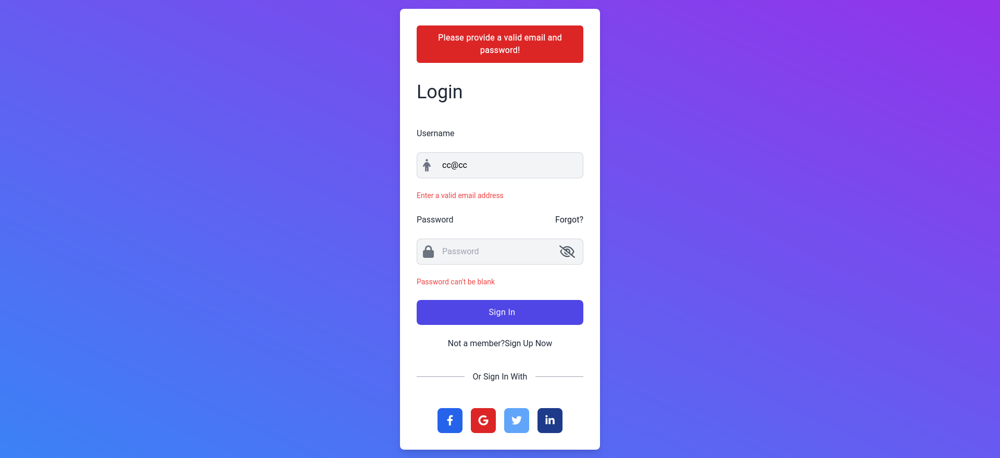
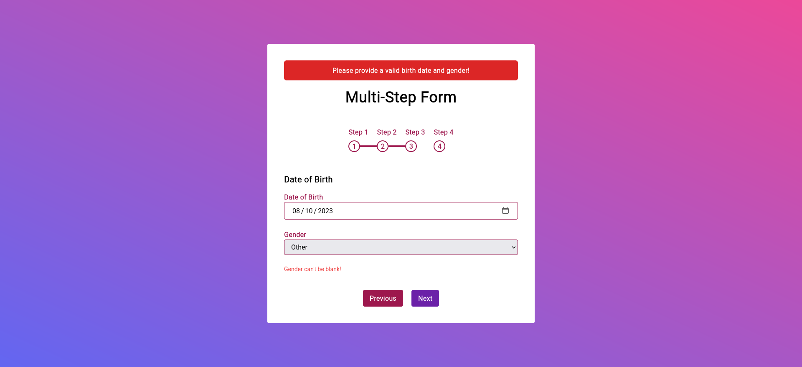

# 📚 Yew Tailwind Components

## 📖 Introduction

[Yew](https://yew.rs/) is a modern Rust framework for building multi-threaded front-end web applications. It aims to provide a productive and pleasant experience for developing front-end applications in Rust, leveraging its safety and performance benefits. By utilizing Yew, we can create interactive and efficient web applications with ease.

## 🚀 Building and Running

1. Fork/Clone the GitHub repository.

	```bash
	git clone https://github.com/wiseaidev/input-yew
	```

1. Navigate to the application directory.

	```bash
	cd examples/tailwind
	```

1. Run the client:

	```sh
	trunk serve --port 3000
	```

Navigate to http://localhost:3000 to explore all available components.

## 🌀 Tailwind CSS Components

This section lists components implemented using the [Tailwind CSS](https://tailwindcss.com/) framework. Tailwind CSS is a utility-first CSS framework that provides a set of pre-defined classes to quickly build custom and responsive designs.

### 🔐 Login Forms

| ID | Preview | Demo | Localhost |
|---|---|---|---|
| 1 |  | [](https://tailwind-login-form-1.netlify.app/) | [Localhost](http://localhost:3000/login/1) |
| 2 |  | [](https://tailwind-login-form-2.netlify.app/) | [Localhost](http://localhost:3000/login/2) |
| 3 |  | [](https://tailwind-login-form-3.netlify.app/) | [Localhost](http://localhost:3000/login/3) |

### 📬 Contact Forms

| ID | Preview | Demo | Localhost |
|---|---|---|---|
| 1 |  | [](https://tailwind-contact-form-1.netlify.app/) | [Localhost](http://localhost:3000/contact/1) |

### 🔢 Multi-Steps Forms

| ID | Preview | Demo | Localhost |
|---|---|---|---|
| 1 |  | [](https://tailwind-multi-step-form-1.netlify.app/) | [Localhost](http://localhost:3000/multi-step/1) |

